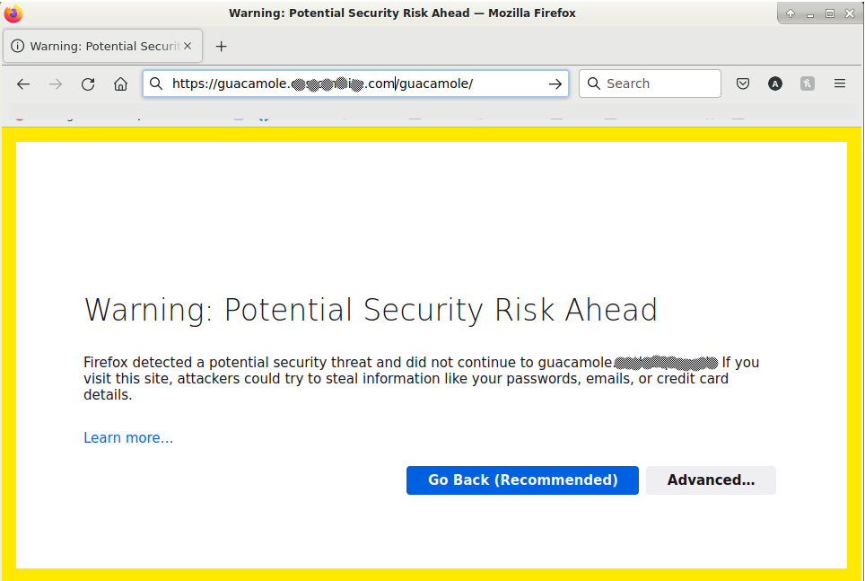
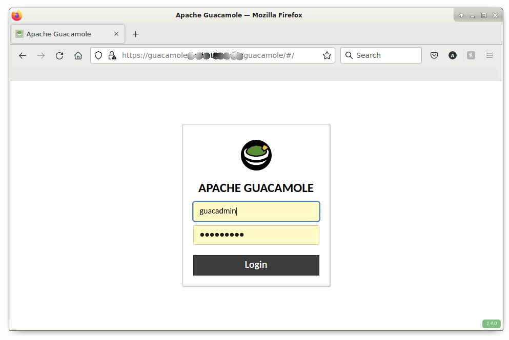

# [docapp-guacamole](../README.md) / 5-Starting Guacamole first time.

After completing the installation, the docker containers just require restarting.

To do this use the 'docapp stop all' command, followed by the 'docapp start all' command.

````
root@docker2:/opt/docapp/bin# docapp stop all
stop ALL containers
Stopping docapp_nginx-proxy_1 ... done
Stopping docapp_guacd_1       ... done
Stopping docapp_guacamole_1   ... done
Stopping docapp_db_1          ... done
Removing docapp_nginx-proxy_1 ... done
Removing docapp_guacd_1       ... done
Removing docapp_guacamole_1   ... done
Removing docapp_db_1          ... done
Removing network docker_default
root@docker2:/opt/docapp/bin# docapp start all
start ALL containers
Creating network "docker_default" with driver "bridge"
Creating docapp_guacd_1       ... done
Creating docapp_db_1          ... done
Creating docapp_guacamole_1   ... done
Creating docapp_nginx-proxy_1 ... done
root@docker2:/opt/docapp/bin# 
````

Open up a web browser to the URL

https://guacamole.custom-site.com/guacamole/

You may see a warning about the SSL certificate being self signed.

Firefox does this mildly scary alert page,



After accepting the exception, you should instead see this nicer login prompt for Guacamole.



Have fun!
